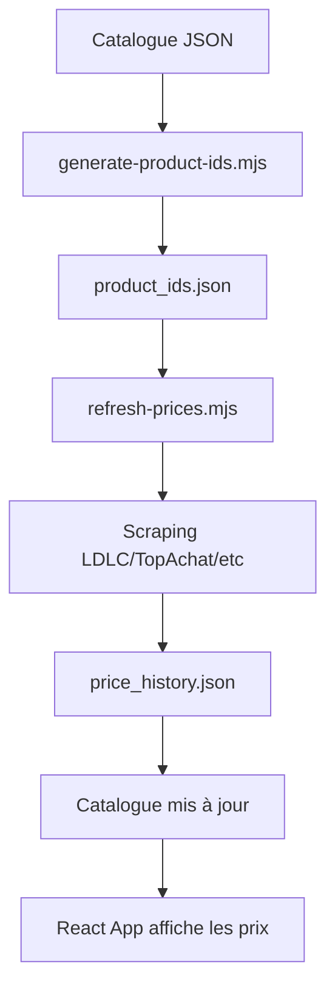

# 🏷️ Comment ajouter les EAN/MPN des GPU, RAM, SSD

## 🎯 Vue d'ensemble

Ce guide vous explique comment remplir le fichier `product_ids.json` pour permettre au système de scraping de trouver les prix en temps réel.

## 📂 Fichiers importants

```
price-sync-free-only/
├── data/
│   ├── product_ids.json              ← À GÉNÉRER (auto)
│   ├── product_ids_manual.json       ← Exemples avec EAN/MPN (manuel)
│   ├── catalogue_2021_2025_master.json
│   └── price_history.json
├── scripts/
│   ├── generate-product-ids.mjs      ← Script de génération AUTO
│   └── refresh-prices.mjs            ← Script de scraping
└── docs/
    └── TROUVER_EAN_MPN.md            ← Guide détaillé
```

## 🚀 Méthode rapide (3 étapes)

### Étape 1 : Générer automatiquement
```bash
# Ouvrir un terminal dans le projet
cd price-sync-free-only
node scripts/generate-product-ids.mjs
```

Ce script va :
- ✅ Lire le catalogue `catalogue_2021_2025_master.json`
- ✅ Extraire les 20 premiers CPUs, GPUs, SSDs, RAM
- ✅ Créer des requêtes de recherche basiques
- ✅ Sauvegarder dans `data/product_ids.json`

**Résultat** : Fichier généré avec ~70 produits

### Étape 2 : Améliorer les produits populaires (OPTIONNEL)
Ouvrir `data/product_ids.json` et ajouter les EAN/MPN pour les top produits :

**Avant :**
```json
{
  "intel-i9-13900k": {
    "query": "Intel Core i9-13900K",
    "category": "cpu"
  }
}
```

**Après :**
```json
{
  "intel-i9-13900k": {
    "mpn": "BX8071513900K",        ← Ajouté
    "query": "Intel Core i9-13900K",
    "category": "cpu"
  }
}
```

**Où trouver les codes ?**
- 📖 Lire `docs/TROUVER_EAN_MPN.md` pour le guide complet
- 🔍 Sites : Amazon, LDLC, EAN-Search.org
- 📋 Copier depuis `data/product_ids_manual.json` (exemples fournis)

### Étape 3 : Tester le scraping
```bash
cd price-sync-free-only
npm install
npm run pw:install
node scripts/refresh-prices.mjs
```

**Ce qui va se passer :**
1. 🔍 Scraping de LDLC, TopAchat, Materiel.net, etc.
2. 💰 Collecte des prix pour chaque produit
3. 📊 Mise à jour du catalogue avec les prix
4. 📈 Sauvegarde de l'historique dans `price_history.json`

**Durée** : 5-10 minutes pour 70 produits (throttling respectueux)

## 📊 Exemples de produits populaires

### CPUs (Haute priorité)
```json
{
  "intel-i9-13900k": {
    "mpn": "BX8071513900K",
    "query": "Intel Core i9-13900K"
  },
  "amd-ryzen-9-7950x": {
    "mpn": "100-100000514WOF",
    "query": "AMD Ryzen 9 7950X"
  },
  "amd-ryzen-7-7800x3d": {
    "mpn": "100-100000910WOF",
    "query": "AMD Ryzen 7 7800X3D"
  }
}
```

### GPUs (Très important)
```json
{
  "nvidia-rtx-4090": {
    "query": "GeForce RTX 4090 24GB"
  },
  "nvidia-rtx-4070": {
    "query": "GeForce RTX 4070 12GB"
  },
  "amd-rx-7900xtx": {
    "query": "Radeon RX 7900 XTX 24GB"
  }
}
```

### SSDs
```json
{
  "samsung-990-pro-1tb": {
    "ean": "8806094638707",
    "mpn": "MZ-V9P1T0BW",
    "query": "Samsung 990 Pro 1TB"
  },
  "wd-sn850x-1tb": {
    "mpn": "WDS100T2X0E",
    "query": "WD Black SN850X 1TB"
  }
}
```

### RAM
```json
{
  "corsair-vengeance-32gb-6000": {
    "mpn": "CMK32GX5M2B6000C36",
    "query": "Corsair Vengeance DDR5 32GB 6000MHz"
  },
  "gskill-tridentz5-32g-6000": {
    "mpn": "F5-6000J3636F16GX2",
    "query": "G.Skill Trident Z5 32GB DDR5 6000MHz"
  }
}
```

## ⚡ Conseils Pro

### 1. Commencez avec les requêtes simples
❌ **Ne perdez pas de temps** à chercher tous les EAN/MPN maintenant
✅ **Lancez le script auto**, testez, puis améliorez progressivement

### 2. Priorisez les best-sellers
Les 10-20 produits les plus vendus suffisent pour commencer :
- Intel i9-13900K, i7-13700K, i5-13600K
- AMD Ryzen 9 7950X, 7900X, 7800X3D
- RTX 4090, 4080, 4070, 3060
- Samsung 990 Pro, WD SN850X
- Corsair/G.Skill DDR5 32GB 6000MHz

### 3. Vérifiez les résultats
Après le premier scraping, vérifiez `data/price_history.json` :
```json
{
  "intel-i9-13900k": [
    {
      "ts": 1729599634000,
      "price": 589.99
    }
  ]
}
```

Si un produit a `[]` (vide), sa requête n'a rien trouvé → améliorez-la !

## 🔄 Workflow complet



## 📝 Fichiers à éditer

### À GÉNÉRER (automatique)
✅ `data/product_ids.json` - Généré par le script

### À CONSULTER (exemples)
📖 `data/product_ids_manual.json` - Exemples avec EAN/MPN complets
📖 `docs/TROUVER_EAN_MPN.md` - Guide détaillé

### À LIRE (docs)
📚 `README.md` - Ce fichier
📚 `../docs/PRICE_SYNC_INTEGRATION.md` - Documentation complète

## ❓ FAQ

**Q: Combien de produits dois-je ajouter ?**
R: Commencez avec 20-30 par catégorie. Le script auto en génère ~70.

**Q: EAN/MPN obligatoires ?**
R: Non ! Les requêtes simples fonctionnent. Les codes améliorent juste la précision.

**Q: Comment savoir si ça marche ?**
R: Lancez le scraping, vérifiez `price_history.json`. S'il y a des prix, ça marche !

**Q: Puis-je ajouter mes propres produits ?**
R: Oui ! Ajoutez-les manuellement dans `product_ids.json` avec le même format.

**Q: À quelle fréquence mettre à jour ?**
R: Recommandé : toutes les 6-12h via GitHub Actions (voir docs).

## 🎯 Checklist

- [ ] Lancer `node scripts/generate-product-ids.mjs`
- [ ] Vérifier que `data/product_ids.json` existe
- [ ] (Optionnel) Ajouter EAN/MPN pour top 10 produits
- [ ] Installer Playwright : `npm run pw:install`
- [ ] Lancer le scraping : `node scripts/refresh-prices.mjs`
- [ ] Vérifier `price_history.json` pour les résultats
- [ ] Tester l'affichage dans React : `npm run dev` (dossier parent)

## 🚀 Prêt !

Une fois ces étapes complétées, votre app React affichera automatiquement les prix en temps réel ! 🎉

**Pour aller plus loin** : Configurez GitHub Actions pour automatiser les mises à jour.
